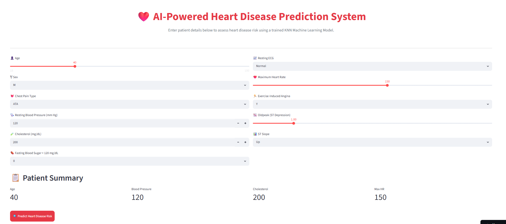

# ❤️ CardioRisk AI – Heart Disease Risk Assessment System

## 📌 Overview

CardioRisk AI is a Machine Learning-powered web application that predicts the likelihood of heart disease based on patient health parameters. The application uses a trained K-Nearest Neighbors (KNN) classification model and provides an intuitive user interface built with Streamlit for real-time risk assessment.

The system enables users to enter clinical information such as age, blood pressure, cholesterol levels, ECG results, and other cardiac indicators to receive an instant prediction regarding heart disease risk.

---

## 🚀 Live Demo

🔗 **Deployed Application:**
https://heart-disease-risk-assessment-system-sarthakdebata.streamlit.app/

---

## ✨ Features

* Interactive and responsive Streamlit interface
* Real-time heart disease risk prediction
* User-friendly healthcare-themed dashboard
* Data preprocessing and feature scaling
* One-hot encoded categorical feature handling
* Machine Learning-based classification
* Instant prediction results with recommendations
* Lightweight and easy to deploy

---

## 🛠️ Tech Stack

### Frontend

* Streamlit

### Backend

* Python

### Machine Learning

* Scikit-learn
* K-Nearest Neighbors (KNN)

### Data Processing

* Pandas
* NumPy

### Model Serialization

* Joblib

---

## 📊 Input Features

The model predicts heart disease risk using the following parameters:

| Feature                | Description                 |
| ---------------------- | --------------------------- |
| Age                    | Patient Age                 |
| Sex                    | Male / Female               |
| Chest Pain Type        | ATA, NAP, TA, ASY           |
| Resting Blood Pressure | Blood Pressure (mm Hg)      |
| Cholesterol            | Cholesterol Level (mg/dL)   |
| Fasting Blood Sugar    | >120 mg/dL                  |
| Resting ECG            | Normal, ST, LVH             |
| Maximum Heart Rate     | Maximum Heart Rate Achieved |
| Exercise Angina        | Exercise-Induced Angina     |
| Oldpeak                | ST Depression               |
| ST Slope               | Up, Flat, Down              |

---

## 🤖 Machine Learning Pipeline

1. Data Collection
2. Data Cleaning and Preprocessing
3. Feature Engineering
4. One-Hot Encoding of Categorical Features
5. Feature Scaling using StandardScaler
6. Model Training using K-Nearest Neighbors (KNN)
7. Model Serialization using Joblib
8. Streamlit Deployment

---

## 📈 Model Performance

### Evaluation Metrics

* R² Score: 0.7988
* Adjusted R² Score: 0.7988

> The model demonstrates strong predictive capability and provides reliable risk assessment based on patient health indicators.

---

## 📂 Project Structure

```text
Heart-Disease-Risk-Assessment-System/
│
├── app.py
├── knn_heart_model.pkl
├── heart_scaler.pkl
├── heart_columns.pkl
├── requirements.txt
├── README.md
│
└── assets/
```

---

## ⚙️ Installation

### Clone Repository

```bash
git clone https://github.com/Gauranga025/Heart-Disease-Risk-Assessment-System.git
cd Heart-Disease-Risk-Assessment-System
```

### Install Dependencies

```bash
pip install -r requirements.txt
```

### Run Application

```bash
streamlit run app.py
```

---

## 📸 Application Preview



### Home Screen

* Patient information input form
* Health parameter dashboard
* Risk prediction button

### Prediction Result

* High Risk Alert
* Low Risk Alert
* Personalized recommendations

---

## 🔮 Future Enhancements

* Probability-based risk scoring
* Advanced ensemble models (Random Forest, XGBoost)
* Patient report generation (PDF)
* Doctor recommendation system
* Historical prediction tracking
* Cloud database integration
* Explainable AI (SHAP/LIME)

---

## 👨‍💻 Author

**Gauranga Debata**

B.Tech, Electronics & Instrumentation Engineering
National Institute of Technology Rourkela

GitHub: https://github.com/Gauranga025

---

## 📜 License

This project is intended for educational, research, and learning purposes.

---

## ⚠️ Disclaimer

This application is designed for educational and demonstration purposes only. It should not be used as a substitute for professional medical diagnosis, treatment, or consultation. Always consult qualified healthcare professionals for medical advice.
